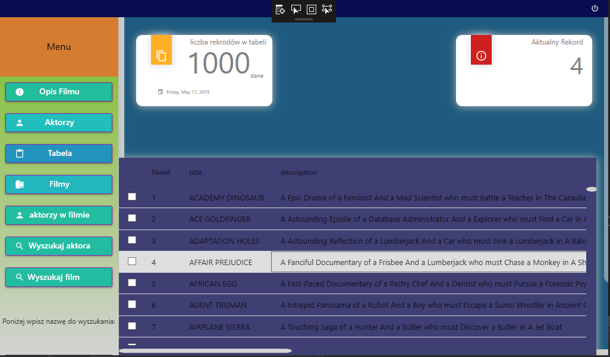
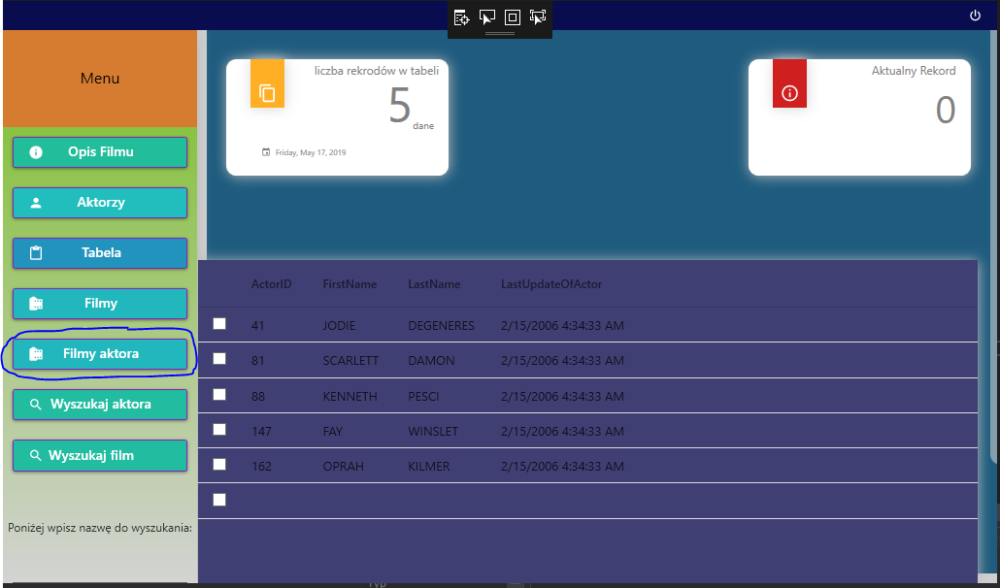
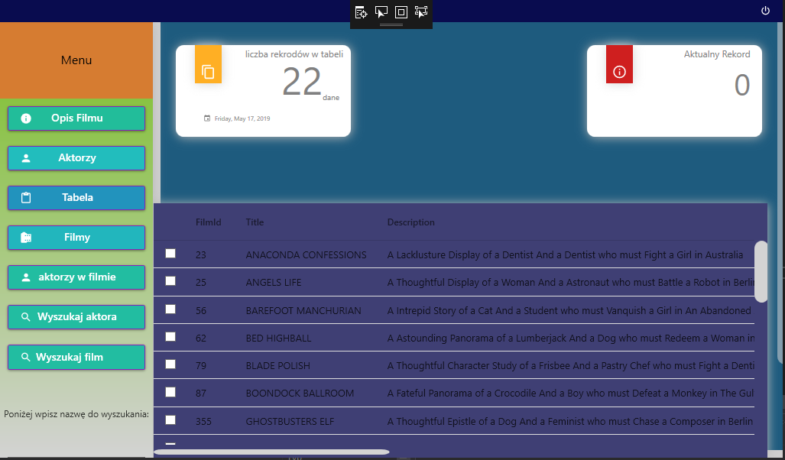
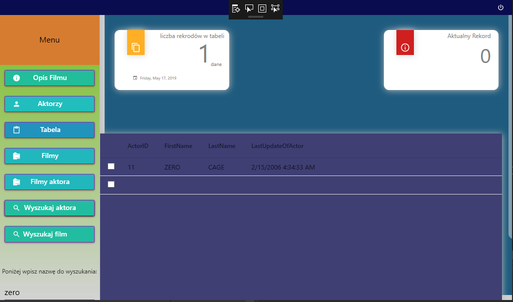
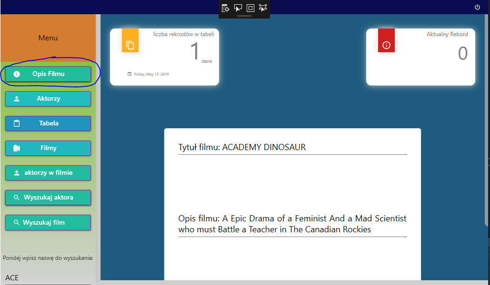

# BazaFilmow
Opis: Pozwala na wyświetlanie filmów,aktorów z tabel z przykładowej bazy danych(filmy,aktorzy,film_aktor),
wyszukiwanie aktora, filmu. Wyświetla aktorów którzy wystąpili w danym filmie oraz jego opisu,filmów w których wystąpił
wybrany aktor. Aplikacja napisana przy użyciu technologii WPF, MySqlWorkbench.

## Ekran logowania:               
 

### Email:1
### Hasło:1234

# Ekran główny   

Ekran główny po naciśnięciu przycisku filmy,w lewym górnym rogu widać liczbę rekorów w tabeli, a w prawym indeks rekordu 
który jest wybrany (pole aktualizuje się po najechaniu na nie kursorem).
 
 # Przycisk aktorzy w filmie:
 
 Po nacisnięciu tego przycisku wyświetlają się wszyscy aktorzy którzy wystąpili w wybranym filmie (w tabeli film_aktor aktorID jest przypisane do filmID).W miejsce tego przycisku pojawia się nowy filmy aktora.
 
 # Przycisk filmy aktora:
  
   Po nacisnięciu tego przycisku wyświetlają się wszystkie filmy wybrane aktora. W miejsce tego przycisku pojawia się przycisk 
   aktorzy w filmie.
   
   # Przycisk wyszukaj aktora:
     
   Wyszukuje aktora po imieniu lub nazwisku, wielkość liter nie ma znaczenia.
 
 # Przycisk wyszukaj film:
 
 Wyszukuje Film.
 # Przycisk Opis filmu:
  
  Ukrywa tabelę i pokazuje opis wybranego filmu.
  
